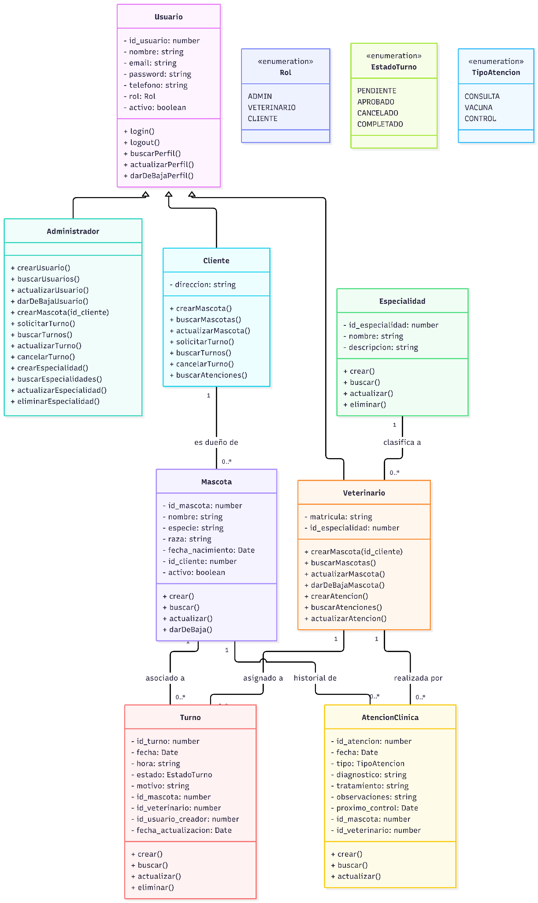

# Trabajo Final — 2° Entrega 29-09-26

## 1. UML

# 2. Requerimientos y Reglas de Negocio

## 2.1 Requerimientos Funcionales

Son las acciones específicas que el sistema debe permitir realizar a los usuarios.

- **Gestión de Acceso:** El sistema debe permitir la autenticación de usuarios mediante correo electrónico y contraseña, redirigiendo a interfaces específicas según el rol (ADMIN, VETERINARIO, CLIENTE).

- **Gestión de Usuarios:** El sistema debe permitir al Administrador realizar el alta, búsqueda, actualización y baja lógica de los perfiles de clientes y personal médico.

- **Gestión de Catálogos:** El sistema debe permitir al Administrador administrar (CRUD completo) las especialidades médicas para asignarlas a los veterinarios.

- **Gestión de Pacientes:** El sistema debe permitir la autogestión total, habilitando al Cliente (desde su portal web), al Administrador y al Veterinario para dar de alta nuevas mascotas, vinculándolas obligatoriamente al perfil de un Cliente existente, así como aplicar bajas lógicas para mantener la trazabilidad.

- **Gestión de Turnos:** El sistema debe permitir solicitar turnos (Cliente/Administrador) y gestionar su estado a lo largo del ciclo de vida: PENDIENTE, APROBADO, CANCELADO o COMPLETADO (Administrador).

- **Historial Clínico:** El sistema debe permitir al Veterinario registrar la atención clínica (Consulta, Vacuna o Control) y permitir tanto a Veterinarios como a Clientes consultar el historial médico inmutable de las mascotas.

## 2.2 Requerimientos No Funcionales

Definen la arquitectura, tecnologías y atributos de calidad del sistema.

- **Pila Tecnológica:** El sistema debe estar desarrollado utilizando Node.js/Express para la API backend y React (con TypeScript) para el frontend.

- **Persistencia de Datos:** La información debe almacenarse en una base de datos relacional MySQL, garantizando la integridad referencial (Foreign Keys) y normalización.

- **Paradigma y Diseño:** El backend debe construirse respetando la Programación Orientada a Objetos (POO), aplicando herencia para los perfiles de usuario y respetando los principios SOLID.

- **Seguridad y Auditoría:** Las contraseñas deben estar encriptadas (ej. bcrypt) y la comunicación protegida. El sistema debe dejar registro del usuario creador y fecha de modificación en las transacciones clave (Turnos).

- **Persistencia de Datos y Normalización (3FN):** La información debe almacenarse en una base de datos relacional MySQL, garantizando la integridad referencial mediante Foreign Keys y respetando estrictamente las reglas de normalización hasta la Tercera Forma Normal (3FN) para eliminar redundancias estructurales:
  - Primera Forma Normal (1FN - Atomicidad): Todos los campos contienen valores atómicos y se eliminaron los grupos repetitivos (ej. creando la tabla independiente Mascota vinculada por id_cliente en lugar de una lista en el perfil del usuario).
  - Segunda Forma Normal (2FN - Dependencia Completa): Todas las entidades poseen una clave primaria simple (autoincrementales como id_usuario o id_turno). Todo atributo no clave depende funcionalmente por completo de esta clave primaria, eliminando el riesgo de dependencias parciales.
  - Tercera Forma Normal (3FN - Sin Dependencias Transitivas): Ningún atributo no clave depende de otro atributo no clave. Esto se evidencia en la extracción de catálogos y descripciones (ej. en la tabla Turno se guarda id_estado_turno en lugar del texto, y el Veterinario depende exclusivamente de Especialidad_id_especialidad).
  - Adicionalmente, respecto al mapeo estructural del diagrama UML, las enumeraciones (Rol, EstadoTurno, TipoAtencion) fueron implementadas físicamente como Tablas Catálogo paramétricas con claves TINYINT. Se descartó el tipo nativo ENUM de MySQL para garantizar la escalabilidad, permitiendo agregar nuevos estados en el futuro como registros (DML) sin necesidad de alterar la estructura física (DDL).

- **Diseño Web Adaptable (Responsive Web Design):** La plataforma debe desarrollarse bajo estándares de diseño web responsivo, garantizando su correcta visualización, navegabilidad y usabilidad en múltiples resoluciones de pantalla. Tanto el portal público (Landing Page y autogestión de clientes) como el sistema de backoffice (perfiles de administradores y veterinarios) deben adaptarse dinámicamente y ser completamente operativos desde dispositivos móviles (smartphones), tablets y computadoras de escritorio.

- **Respaldo de Información (Backups Automatizados):** Para garantizar la integridad y el resguardo de la información clínica y operativa, el sistema debe ejecutar una política de copias de seguridad automatizadas de la base de datos relacional. Para el alcance de este MVP, se establecerá un backup completo diario (frecuencia de 24 horas) ejecutado en horario nocturno, conservando un histórico de retención de al menos 7 días para permitir la recuperación ante fallos críticos.

- **Disponibilidad del Sistema (Uptime):** La plataforma web debe asegurar una alta disponibilidad orientada a la franja horaria operativa de la clínica. El sistema apuntará a un nivel de servicio (SLA) del 99% de tiempo de actividad durante el horario comercial, garantizando que el personal y los clientes puedan gestionar la agenda médica sin interrupciones. Las tareas de mantenimiento o despliegue de actualizaciones deberán programarse fuera de esta franja para minimizar el impacto.

- **Autenticación y Manejo de Sesión (JWT):** La plataforma implementará un sistema de autenticación sin estado (stateless) basado en JSON Web Tokens (JWT) para gestionar las sesiones de los usuarios de manera segura.
  - Inicio de Sesión: Al ejecutar el método iniciarSesion(), el backend validará las credenciales contra la base de datos y emitirá un token JWT firmado digitalmente. Este token contendrá en su carga útil (payload) el id_usuario y el id_rol, permitiendo identificar al actor y sus permisos.
  - Manejo de Sesión: El frontend almacenará el JWT de forma segura (ej. Local Storage o HTTP-Only Cookies) y lo enviará en la cabecera (Header de Autorización: Bearer) de cada petición HTTP para acceder a las rutas protegidas.
  - Cierre de Sesión y Seguridad: El token tendrá un tiempo de expiración corto (ej. 8 horas) para mitigar riesgos. La acción de cerrarSesion() se resolverá del lado del cliente eliminando el token del almacenamiento local, cortando inmediatamente el acceso al sistema.

## 2.3 Reglas de Negocio

Son las restricciones lógicas y operativas propias del dominio de la clínica veterinaria que gobiernan cómo se comportan los datos.

- **RN-01: Trazabilidad Histórica (Baja Lógica):** Queda estrictamente prohibida la eliminación física (DELETE) de registros de Usuarios y Mascotas en la base de datos. Se debe aplicar una "Baja Lógica" cambiando el estado del atributo activo a false para preservar el historial clínico y contable ante cualquier eventualidad legal.

- **RN-02: Dependencia Estricta del Paciente:** Una Mascota no puede existir en el sistema de forma aislada. Su creación requiere obligatoriamente la vinculación a un Cliente responsable registrado en el sistema (Relación 1 a N).

- **RN-03: Integridad y Auditoría del Registro Clínico:** Queda estrictamente prohibida la eliminación física (DELETE) o la baja lógica de un registro de AtencionClinica una vez guardado. Se permite la actualización de los datos, como la corrección de errores ortográficos o la ampliación del diagnóstico y tratamiento, exclusivamente al Veterinario que haya registrado la atención clínica. Toda modificación debe quedar registrada de forma transparente, actualizando automáticamente los campos id_usuario_ultima_modificacion y fecha_ultima_modificacion de la base de datos, con el objetivo de preservar la trazabilidad e integridad del historial clínico.

- **RN-04: Exclusividad de Especialidades:** El vínculo con una especialidad médica se persiste de forma exclusiva en la tabla Veterinario aplicando la estrategia Class Table Inheritance. Para Administradores y Clientes, esta relación es estructuralmente inexistente, evitando la proliferación de valores nulos en la base de datos.

- **RN-05: Control Centralizado de Agenda:** Los Clientes tienen permisos limitados sobre los turnos: pueden solicitar turnos, que ingresan en estado PENDIENTE, y cancelar sus propios turnos. El Administrador es responsable de aprobar, reprogramar, cancelar y completar turnos manualmente. El Veterinario no puede modificar manualmente el estado de los turnos. Sin embargo, cuando registra una atención clínica asociada a un turno, el backend debe cambiar automáticamente el estado de dicho turno a COMPLETADO.

- **RN-06: Auditoría de Reservas:** Todo turno generado debe registrar de forma inmutable el ID del usuario que originó la transacción (id_usuario_creador), permitiendo a la clínica auditar si el turno fue solicitado directamente por el Cliente o cargado manualmente por el Administrador durante las tareas de recepción.

- **RN-07: Resolución de Identidad (Usuarios a Perfiles Específicos):** Dado que el modelo implementa la separación de tablas mediante Class Table Inheritance, las operaciones exclusivas de un rol (como la creación de mascotas por parte de un Cliente o el registro de una atención por un Veterinario) requieren una resolución de identidad. La sesión del sistema opera sobre la base del id_usuario. Antes de ejecutar inserciones o consultas en entidades dependientes (como Mascota o Turno), el backend debe obligatoriamente cruzar el id_usuario con la tabla de la extensión del perfil (Cliente o Veterinario) para obtener y operar con la clave primaria específica (id_cliente o id_veterinario).

- **RN-08: Gestión de Dominios Cerrados (Estados y Tipos):** Los valores correspondientes a los roles de sistema, los estados de los turnos y los tipos de atención clínica operan como dominios cerrados mediante tablas catálogo. El código de la aplicación (backend) debe consumir estos catálogos dinámicamente mediante sus respectivos identificadores (id_rol, id_estado_turno, id_tipo_atencion) en lugar de validar cadenas de texto plano (strings) en el código, asegurando la consistencia entre la base de datos y la lógica de negocio.

- **RN-09: Trazabilidad Turno-Atención (Cierre Automático):**  Una atención médica puede registrarse como espontánea o asociarse a un turno existente. En este último caso, el sistema deberá validar que el turno corresponda a la misma mascota y veterinario, que se encuentre en estado `APROBADO` y que no tenga otra atención asociada. Una vez registrada la atención, el sistema cambiará automáticamente el estado del turno a `COMPLETADO`. Los turnos en estado `PENDIENTE` o `CANCELADO` no podrán completarse mediante este mecanismo.

- **RN-10: Baja lógica de Mascotas y gestión de turnos asociados:** Cuando una mascota recibe una baja lógica, el sistema debe cambiar su estado a inactivo (activo = false) y cancelar automáticamente los turnos futuros asociados que se encuentren en estado PENDIENTE o APROBADO. Los turnos históricos y las atenciones clínicas registradas deben conservarse para mantener la trazabilidad del historial. No se podrán generar nuevos turnos ni registrar nuevas atenciones clínicas para mascotas inactivas. La reactivación de una mascota solo podrá ser realizada por el Administrador o el Veterinario, verificando previamente que sus datos se encuentren vigentes.

- **RN-11: Motor de Cálculo de Disponibilidad:** El sistema calcula los horarios disponibles de forma dinámica. Para ello, segmenta la franja horaria definida en la entidad HorarioAtencion (desde hora_inicio hasta hora_fin) basándose en el intervalo_minutos estipulado para ese profesional (ej. consultas de 30 minutos). A ese total de bloques posibles, el backend le resta automáticamente aquellos horarios que ya se encuentren registrados en la entidad Turno con estado PENDIENTE o APROBADO para esa misma fecha y veterinario.

- **RN-12: Registro Específico de Vacunación:** Cuando una atención médica se categoriza bajo el TipoAtencion de "Vacuna", el sistema trasciende el registro clínico estándar y exige completar obligatoriamente la entidad VacunaAplicada. Este registro anexo asegura la trazabilidad del insumo médico (lote, dosis, laboratorio) y proyecta la fecha de la proxima_aplicacion.

- **RN-13: Control de Acceso y Gestión de Mascotas:** El sistema debe garantizar que las operaciones sobre mascotas respeten los permisos establecidos para cada rol. El Administrador y el Veterinario podrán crear, consultar, modificar y dar de baja lógicamente cualquier mascota registrada. El Cliente podrá crear, consultar y modificar únicamente las mascotas asociadas a su propio perfil, sin disponer de permisos para dar de baja registros. Todas las operaciones deberán validarse en el backend, verificando la identidad del usuario, su rol y, cuando corresponda, la pertenencia de la mascota al cliente autenticado.

---

# 3. Módulos a Desarrollar

## 3.0 Módulo de Portal Web Público (Landing Page):

- **Interfaz pública de presentación de la veterinaria.** Actúa como el punto de entrada principal para la captación de clientes. Contiene información institucional estática (servicios ofrecidos, ubicación, horarios de contacto) y provee los accesos directos (Call to Action) para que los usuarios visitantes puedan iniciar sesión o registrarse en la plataforma de autogestión.

## 3.1 Módulo de Autenticación y Seguridad

- **Gestión de Accesos:** Desarrollo del sistema de Login y Logout para todos los usuarios.
- **Autorización basada en Roles (RBAC):** Implementación de middlewares en Node.js para proteger las rutas según el rol del usuario (Administrador, Veterinario, Cliente), asegurando que un cliente no pueda acceder a endpoints exclusivos de la clínica.

## 3.2 Módulo de Gestión de Usuarios y Perfiles

- **ABML de Usuarios (Admin):** Interfaz y endpoints para que el Administrador pueda crear, buscar, actualizar y aplicar la baja lógica (soft delete) a cualquier cuenta del sistema (asignando roles y vinculando veterinarios a sus especialidades).
- **Autogestión de Perfil:** Vista para que los clientes y veterinarios puedan visualizar y actualizar sus propios datos personales de contacto (teléfono, dirección, etc.).

## 3.3 Módulo de Gestión de Mascotas (Pacientes)

- **Alta y Vinculación (Autogestión):** Funcionalidad transversal que permite registrar una nueva mascota. Cuando la acción es ejecutada por el Cliente en el portal, el sistema vincula automáticamente el animal a su sesión activa; cuando es ejecutada por un Administrador o Veterinario en la clínica, el sistema exige ingresar manualmente el ID de un Cliente existente.
- **Búsqueda y Actualización (Admin/Vet):** Listados filtrables para que tanto el Administrador como el Veterinario puedan buscar mascotas por dueño, número de documento o nombre. Incluye la capacidad de actualizar datos básicos (raza, edad) y aplicar bajas lógicas en caso de fallecimiento, conservando la trazabilidad.
- **Mis Mascotas (Cliente):** Interfaz central del portal del cliente donde el dueño puede visualizar las tarjetas de información de sus mascotas activas y gestionar sus perfiles (actualizar datos básicos como raza, observaciones o sexo), consolidando la autonomía del usuario sobre la información de sus animales.

## 3.4 Módulo de Agenda y Turnos

- **Solicitud de Turnos:** Interfaz web para que el Cliente o el Administrador soliciten un turno para una mascota específica, vinculando fecha, hora, veterinario y motivo.
- **Gestión y Trazabilidad (Admin):** Panel de control para que el administrador visualice, apruebe o modifique los turnos. Incluye el registro interno de auditoría (id_usuario_creador y fecha_actualizacion).
- **Cancelación de Turnos:** Funcionalidad para que tanto clientes como administradores puedan cambiar el estado de un turno a "CANCELADO" sin eliminar el registro físico.
- **Consulta de Agenda (Veterinario):** Vista de solo lectura para que el profesional médico pueda visualizar los turnos que tiene asignados en el día, incluyendo el motivo de la consulta, el horario y el paciente a atender.
- **Configuración de Agenda Médica (Administrador):** Interfaz interna que permite al administrador definir los días laborables (dia_semana), el horario de apertura y cierre, y la duración estándar de las consultas (intervalo_minutos) para cada médico. Estos parámetros son el insumo principal que utiliza el sistema para proyectar la disponibilidad en el portal de clientes.

## 3.5 Módulo de Atención Clínica y Libreta Sanitaria

- **Registro Médico (Veterinario):** Formularios para que el profesional registre el resultado de una visita. El sistema permite seleccionar el turno PENDIENTE o APROBADO asignado a ese paciente para vincularlo directamente con la nueva atención clínica. El profesional categoriza la visita (Consulta, Vacuna o Control), ingresando diagnóstico, tratamiento y fecha del proximo_control.
- **Libreta Sanitaria Digital (Propuesta de Valor):** Vista de solo lectura diseñada como el núcleo del portal web del Cliente, donde el dueño puede consultar la línea de tiempo con el historial auditado de vacunas y atenciones de sus propias mascotas. El Veterinario también cuenta con un acceso equivalente (modo clínico) para revisar el registro completo de cualquier paciente antes de atenderlo, visualizando la trazabilidad de cualquier corrección o ampliación médica realizada.

## 3.6 Módulo de Catálogos (Configuración)

- **Gestión de Especialidades:** CRUD exclusivo para el Administrador que permite administrar las áreas médicas disponibles en la clínica (Cardiología, Diagnóstico por imagen, etc.) para luego asignarlas al plantel veterinario.

---

# 4. Matriz de Permisos del MVP

| **Entidad**         | **Acción**               | **Administrador**                             | **Veterinario**                          | **Cliente**                         |
| ------------------- | ------------------------ | --------------------------------------------- | ---------------------------------------- | ----------------------------------- |
| Usuarios            | Crear                    | ✔ (Cualquier rol: Admin, Vet, Cliente)        | X                                        | ✔ (Solo cuenta propia, rol Cliente) |
| (Perfiles)          | Consultar                | ✔ (Todos)                                     | ✔ (Solo propio)                          | ✔ (Solo propio)                     |
|                     | Modificar                | ✔ (Todos)                                     | ✔ (Solo propio)                          | ✔ (Solo propio)                     |
|                     | Dar de baja              | ✔ (Todos)                                     | X                                        | X                                   |
| **Mascotas**        | Crear                    | ✔                                             | ✔                                        | ✔ (Propias)                         |
|                     | Consultar                | ✔ (Todas)                                     | ✔ (Todas)                                | ✔ (Propias)                         |
|                     | Modificar                | ✔                                             | ✔                                        | ✔ (Propias)                         |
|                     | Baja lógica              | ✔                                             | ✔                                        | X                                   |
| (Pacientes)         | Consultar                | ✔ (Todas)                                     | ✔ (Todas)                                | ✔ (Solo propias)                    |
|                     | Modificar                | ✔ (Todas)                                     | ✔ (Todas)                                | ✔ (Solo propias)                    |
|                     | Dar de baja              | ✔ (Todas)                                     | ✔ (Todas)                                | ✔ (Solo propias)                    |
| Turnos (Agenda)     | Cancelar / Completar     | ✔ (Puede realizar ambas acciones manualmente) | ✘ (No puede cambiar estados manualmente) | ✔ (Solo cancelar turnos propios)    |
| (Agenda)            | Consultar                | ✔ (Todos)                                     | ✔ (Solo asignados)                       | ✔ (Solo propios)                    |
|                     | Modificar (Reprogramar)  | ✔ (Control total)                             | X                                        | X                                   |
|                     | Cancelar / Completar     | ✔ (Ambas acciones)                            | X                                        | ✔ (Solo cancelar)                   |
| Atención Clínica    | Crear (Registrar)        | X                                             | ✔                                        | X                                   |
| (Libreta Sanitaria) | Consultar                | X                                             | ✔ (Todas)                                | ✔ (Solo propias)                    |
|                     | Modificar (Correcciones) | X                                             | ✔ (Sus registros)                        | X                                   |
|                     | Dar de baja              | X (RN-03: Inmutable)                          | X (RN-03: Inmutable)                     | X (RN-03: Inmutable)                |
| Especialidades      | Crear                    | ✔                                             | X                                        | X                                   |
| (Catálogo)          | Consultar                | ✔                                             | ✔                                        | X                                   |
|                     | Modificar                | ✔                                             | X                                        | X                                   |
|                     | Dar de baja              | ✔                                             | X                                        | X                                   |

Aclaración: La transición de un turno al estado COMPLETADO también puede realizarse automáticamente desde el backend cuando el Veterinario registra una atención clínica asociada al turno. Esta transición automática no constituye una modificación manual del estado por parte del Veterinario.

**Referencias:**

- ✔: Permiso concedido (con el alcance aclarado entre paréntesis).
- X: Permiso denegado por arquitectura o regla de negocio.
- RN-03: El historial clínico tiene estrictamente prohibida su eliminación para garantizar trazabilidad legal.
- Aclaración: La transición de un turno al estado COMPLETADO también puede realizarse automáticamente desde el backend cuando el Veterinario registra una atención clínica asociada al turno. Esta transición automática no constituye una modificación manual del estado por parte del Veterinario.

| **Estado Origen** | **Estado Destino** | **Actor Responsable**  | **Regla de Negocio / Disparador**                                                           |
| ----------------- | ------------------ | ---------------------- | ------------------------------------------------------------------------------------------- |
| N/A (Creación)    | PENDIENTE          | Cliente, Administrador | Se genera al solicitar una nueva reserva en el sistema.                                     |
| PENDIENTE         | APROBADO           | Administrador          | El administrador confirma la solicitud del turno.                                           |
| PENDIENTE         | CANCELADO          | Cliente, Administrador | El cliente cancela su propio turno o el administrador cancela cualquier turno.              |
| APROBADO          | CANCELADO          | Cliente, Administrador | El cliente cancela su propio turno o el administrador cancela cualquier turno.              |
| APROBADO          | COMPLETADO         | Sistema                | Se registra una atención médica asociada al turno y se cumplen las condiciones de la RN-09. |

---

# 5. Historias de Usuario

## 5.0 Módulo 0: Landing Page

### HU-VET-00: Visualización del Portal Público (Landing Page)

Como usuario visitante, quiero acceder a la página de inicio pública de la veterinaria, para conocer los servicios que ofrecen, sus datos de contacto y encontrar los accesos a la plataforma web.

#### Criterios de aceptación:

- El sistema debe mostrar una interfaz pública accesible sin necesidad de autenticación.
- La página debe incluir información institucional básica (logo, dirección, servicios y vías de contacto).
- La interfaz debe contar con botones de acceso claros ("Llamados a la acción") que redirijan a los flujos de "Iniciar Sesión" (HU-VET-01) y "Registrarse" (HU-VET-01b).
- El diseño debe ser responsivo (adaptable a dispositivos móviles) para facilitar el acceso de los clientes desde sus teléfonos.

## 5.1 Módulo 1: Autenticación y Seguridad

### HU-VET-01a: Iniciar sesión en el sistema

Como usuario registrado (Administrador, Veterinario o Cliente), quiero iniciar sesión utilizando mi email y contraseña, para acceder a las funcionalidades correspondientes a mi perfil.

#### Criterios de aceptación

- El sistema debe validar que las credenciales coincidan con los registros de la base de datos.
- Se debe validar el atributo activo: si el usuario tiene activo = false (baja lógica), el sistema debe denegar el acceso y mostrar un mensaje de error.
- Tras un inicio exitoso, el sistema debe redirigir a una vista específica según el atributo rol del usuario.

### HU-VET-01b: Alta centralizada de usuarios (Backoffice)

Como Administrador, quiero poder registrar nuevas cuentas de usuario en el sistema y asignarles su rol correspondiente, para dar de alta al nuevo personal de la clínica (Veterinarios/Admins) o a clientes que se presentan presencialmente y no poseen cuenta web.

#### Criterios de aceptación:

- El formulario interno debe permitir al Administrador seleccionar el rol del nuevo usuario (id_rol mapeado a Administrador, Veterinario o Cliente).
- Si el Administrador selecciona el rol Cliente, el sistema debe habilitar el flujo secundario para ejecutar el método crearMascota() y vincular al animal inmediatamente.
- Si el Administrador selecciona el rol Veterinario, el sistema debe requerir el ingreso de la matrícula y la vinculación a una Especialidad existente.
- El registro de un Cliente no implica la creación automática de una mascota. Una vez creada su cuenta y perfil, el Cliente podrá registrar sus propias mascotas mediante la funcionalidad de alta de pacientes, definida en la HU-VET-04.

### HU-VET-01c: Registro público de Cliente y Mascota (Onboarding)

Como usuario visitante, quiero poder registrar una cuenta en el portal y cargar los datos primarios de mi mascota, para convertirme en cliente de la veterinaria y poder solicitar turnos online.

#### Criterios de aceptación:

- El formulario de registro público debe solicitar los datos personales del usuario (nombre, apellido, email, contraseña, teléfono).
- Seguridad (Hardcoding de Rol): El backend debe asignar automáticamente y de forma obligatoria el id_rol correspondiente a CLIENTE a todas las cuentas creadas desde esta interfaz pública.
  Una vez creada la cuenta de usuario, el flujo (Onboarding) debe redirigir al cliente a un segundo formulario para ejecutar el método crearMascota(), solicitando los datos primarios del animal (nombre, especie, raza).
- Las contraseñas deben almacenarse encriptadas (ej. bcrypt) en la base de datos.

---

## 5.2 Módulo 2: Gestión de Usuarios y Perfiles

### HU-VET-02: Gestión Integral de Usuarios y Perfiles (ABML)

Como Administrador, quiero registrar, consultar, actualizar y dar de baja lógicamente a los usuarios, para controlar los accesos y administrar los perfiles específicos de la clínica veterinaria.
Criterios de Aceptación:

- Mapeo de Herencia (Alta de usuario): La creación de un perfil debe impactar en las tablas correspondientes aplicando la estrategia de herencia Class Table Inheritance:
  - Si el rol es ADMIN, los datos se insertan únicamente en la tabla base Usuario.
  - Si el rol es CLIENTE, el sistema debe generar el registro base en Usuario y su extensión vinculada en la tabla Cliente.
  - Si el rol es VETERINARIO, el sistema debe generar el registro base en Usuario y su extensión vinculada en la tabla Veterinario.
- Asignación de Especialidad: Al crear o actualizar un perfil con rol VETERINARIO, es obligatorio proporcionar una especialidad médica válida, la cual se persiste exclusivamente a través del campo Especialidad_id_especialidad en la tabla Veterinario. Los usuarios con roles CLIENTE o ADMIN carecen por completo de esta relación.
- Baja Lógica (Soft Delete): La acción de dar de baja a cualquier perfil debe modificar únicamente el atributo activo = false en la tabla base Usuario. Queda estrictamente prohibida la ejecución de eliminaciones físicas (SQL DELETE) para garantizar la trazabilidad histórica de los turnos y atenciones.
- Visibilidad de Inactivos: Los usuarios dados de baja lógica no deben aparecer en los listados ni selectores habituales de la interfaz. Solo serán visibles si el Administrador activa un filtro explícito para consultar registros inactivos.

### HU-VET-03: Autogestión de Perfil Personal

Como usuario autenticado, quiero poder actualizar mis propios datos personales, para mantener mi información de contacto al día.

#### Criterios de aceptación

- El usuario solo puede invocar el método actualizarPerfil() sobre su propio id_usuario.
- El sistema no debe permitir que, mediante esta vista, el usuario modifique su propio rol, su estado activo, ni su id_especialidad.

---

## 5.3 Módulo 3: Gestión de Mascotas (Pacientes)

### HU-VET-04: Alta y vinculación de Paciente

Como Administrador, Veterinario o Cliente, quiero registrar una nueva mascota y asociarla obligatoriamente a un cliente existente, para incorporar al paciente al sistema y permitir su seguimiento.

#### Criterios de aceptación

- El Administrador y el Veterinario pueden registrar mascotas y asociarlas a cualquier cliente existente.
- El Cliente puede registrar únicamente mascotas asociadas a su propio perfil, obtenido a partir de la sesión autenticada.
- El sistema debe validar que el cliente asociado exista y se encuentre activo.
- Por defecto, la mascota se registra con activo = true.
  No se permite registrar una mascota con una fecha de nacimiento posterior a la fecha actual.

### HU-VET-05: Baja lógica de Paciente

Como Administrador o Veterinario, quiero aplicar una baja lógica a una mascota, para excluirla de las nuevas atenciones y reservas, preservando su historial clínico.

#### Criterios de aceptación

- El Administrador puede dar de baja cualquier mascota registrada.
- El Veterinario puede dar de baja cualquier mascota registrada.
- El Cliente no puede dar de baja directamente a sus mascotas desde el sistema.
- Al realizar la baja, el atributo activo debe cambiar a false.
- El sistema debe cancelar automáticamente los turnos futuros PENDIENTES o APROBADOS asociados a la mascota.
- Las atenciones clínicas y los turnos históricos deben conservarse y permanecer consultables por los usuarios autorizados.
- El sistema debe impedir la creación de nuevos turnos y atenciones para mascotas inactivas.
- Liberación de agenda (Cascada): Al confirmar la baja lógica de la mascota, el sistema debe identificar automáticamente todos los turnos futuros vinculados a esta que se encuentren en estado PENDIENTE o APROBADO, y cambiar su estado a CANCELADO.

### HU-VET-06-a: Visualización de mis mascotas

Como Cliente, quiero visualizar un listado con los perfiles de mis mascotas, para consultar su información básica registrada.

#### Criterios de aceptación

- El método buscarMascotas() invocado por el Cliente debe filtrar automáticamente los resultados asociados a su perfil. Para ello, el sistema utilizará el id_usuario de la sesión activa para consultar la tabla Cliente, obtener el id_cliente correspondiente, y utilizar este último para buscar en la tabla Mascota.
- Solo se deben listar las mascotas que tengan activo = true (baja lógica).

### HU-VET-06-b: Actualización de datos de mascotas (Autogestión)

Como Cliente, quiero poder editar la información básica de los perfiles de mis mascotas, para mantener sus datos actualizados sin tener que depender del administrador de la clínica.

#### Criterios de aceptación:

- El Cliente puede modificar únicamente los campos descriptivos autorizados de sus propias mascotas, como raza, sexo y observaciones.
- El Administrador y el Veterinario pueden modificar los datos de cualquier mascota, de acuerdo con sus responsabilidades dentro de la clínica.
- Ningún usuario puede modificar la mascota de un Cliente distinto cuando actúa con el rol Cliente.
- No se permite modificar los datos de una mascota inactiva mediante el flujo habitual de edición.
- Toda modificación debe actualizar automáticamente el campo fecha_actualizacion.

### HU-VET-06-c: Búsqueda de pacientes por parte del administrador

Como Administrador, quiero buscar y visualizar las mascotas registradas asociadas a un cliente específico, para poder seleccionar al paciente correcto al momento de agendar un turno de forma manual. Criterios de aceptación:

- El método buscarMascotas() ejecutado por el perfil Administrador debe permitir filtrar resultados por el id_cliente o nombre del dueño.
- El sistema debe devolver el listado de mascotas activas (activo = true) permitiendo al Administrador seleccionarlas para continuar con el flujo de solicitud de turno.

---

## 5.4 Módulo 4: Agenda y Turnos

### HU-VET-07a: Solicitud de Turno Médico

Como Cliente o Administrador, quiero solicitar un turno seleccionando mascota, fecha, hora, motivo y veterinario, para reservar un espacio de atención en la clínica.

#### Criterios de aceptación

- Al ejecutar solicitarTurno(), el registro se guarda por defecto con el estado = PENDIENTE.
- El sistema debe registrar automáticamente en el atributo id_usuario_creador el ID de la persona logueada (ya sea el propio cliente o el administrador en recepción).
- Filtro y Motor de Disponibilidad: Al momento de solicitar el turno, la interfaz no debe permitir seleccionar horarios arbitrarios, presentando únicamente un selector con los bloques estrictamente libres. Para calcularlos dinámicamente, el backend cruzará las franjas activas de la tabla HorarioAtencion del profesional, fragmentándolas según su intervalo_minutos, y restando aquellos horarios ya ocupados en la tabla Turno (estados PENDIENTE o APROBADO).

### HU-VET-07b: Configuración de Horarios de Atención

Como Administrador, quiero configurar los días, franjas horarias e intervalos de atención de cada Veterinario, para que el sistema pueda calcular y ofrecer automáticamente los turnos disponibles a los clientes.

#### Criterios de aceptación:

- El sistema debe permitir definir franjas horarias indicando el dia_semana, la hora_inicio y la hora_fin para un id_veterinario específico.
- Se debe poder configurar la duración de cada consulta mediante el campo numérico intervalo_minutos.
- El formulario debe permitir guardar múltiples registros para un mismo veterinario (ejemplo: cargar una franja para el lunes a la mañana y otra separada para el lunes a la tarde).

### HU-VET-08: Gestión de Agenda Diaria

Como Administrador, quiero gestionar los cambios de estado de los turnos solicitados, para mantener la agenda organizada, confirmar la asistencia y auditar las atenciones finalizadas. Criterios de aceptación:

#### Criterios de aceptación

- El sistema debe permitir al Administrador cambiar el estado de una reserva de PENDIENTE a APROBADO tras confirmar la disponibilidad en la agenda.
- Transición a COMPLETADO (Disparador Automático): Cuando el Veterinario registra una atención clínica asociada a un turno, el backend debe cambiar automáticamente el estado del turno a COMPLETADO. Esta operación no requiere que el Veterinario modifique manualmente el estado. El Administrador también puede establecer manualmente este estado en situaciones excepcionales, dejando registrada la modificación para fines de auditoría.
- El Administrador debe tener la capacidad de pasar un turno a CANCELADO si el cliente avisa su inasistencia o si el profesional no se presenta.
- Queda estrictamente prohibida la eliminación física del registro del turno de la base de datos, garantizando que el historial de reservas quede intacto para auditoría.
- El sistema debe registrar automáticamente la marca de tiempo de cualquier modificación de estado en el campo fecha_actualizacion de la tabla Turno.

### HU-VET-09a: Cancelación de Turno Propio

Como Cliente, quiero cancelar un turno que solicité previamente, para liberar el horario si no puedo asistir.

#### Criterios de aceptación

- El Cliente solo puede ejecutar el método cancelar Turno() sobre aquellos registros donde la mascota pertenezca a su id_cliente.
- La acción solo modifica el estado a CANCELADO y estampa la fecha_actualizacion; bajo ningún concepto elimina físicamente la fila de la base de datos.

### HU-VET-09b: Consulta de Agenda Médica

Como Veterinario, quiero visualizar el listado de turnos que tengo asignados, para organizar mi jornada laboral y prepararme para los pacientes que atenderé.

#### Criterios de aceptación:

- El método buscarTurnos() invocado por el Veterinario debe filtrar automáticamente la búsqueda en la base de datos utilizando su propio id_veterinario resuelto desde su sesión.
- El sistema no debe permitir al Veterinario modificar el estado de los turnos, reprogramarlos ni cancelarlos (acciones exclusivas del Administrador y/o Cliente).
- La vista debe ordenar los turnos cronológicamente por el atributo fecha_hora.
- La restricción de modificación manual de estados no impide que el backend actualice automáticamente un turno a `COMPLETADO` cuando se registra una atención clínica asociada, según lo establecido en la HU-VET-08.

### HU-VET-09c: Consulta de próximos turnos (Cliente)

Como Cliente, quiero visualizar el listado de mis próximos turnos solicitados, para recordar las fechas, horarios y profesionales asignados a mis mascotas.

#### Criterios de aceptación:

- El método consultar Turnos() invocado por el Cliente debe filtrar automáticamente la búsqueda, devolviendo exclusivamente los registros asociados a las mascotas que pertenecen a su propio id_cliente.
- La interfaz debe mostrar únicamente los turnos que se encuentren en estado PENDIENTE o APROBADO. Los turnos históricos (COMPLETADO o CANCELADO) no deben aparecer en esta vista principal (podrían ir a un historial separado).
- El listado debe ordenarse cronológicamente de forma ascendente utilizando el campo fecha_hora.
- Desde esta misma vista, el usuario debe tener a la vista la opción de cancelar la reserva, lo cual actúa como disparador del flujo detallado en la HU-VET-09a.

---

## 5.5 Módulo 5: Atención Clínica y Libreta Sanitaria

### HU-VET-10a: Registro de Atención Médica

Como Veterinario, quiero registrar el resultado de una nueva atención clínica, asociándola opcionalmente a un turno previo, para asentar el diagnóstico y tratamiento de la mascota en su libreta sanitaria.

#### Criterios de aceptación

- Solo los usuarios con rol VETERINARIO pueden registrar nuevas atenciones clínicas.
- El sistema debe requerir los campos obligatorios: id_mascota, id_veterinario, id_tipo_atencion, diagnóstico y tratamiento. El campo proximo_control es opcional.
- Vinculación opcional (Urgencias): El formulario debe permitir dejar el id_turno en blanco (NULL) para admitir consultas espontáneas.
- Validación de coincidencia: Si el Veterinario selecciona un turno, el backend debe validar que el id_mascota y el id_veterinario ingresados coincidan exactamente con los registrados en ese turno.
- Disparador de estado: Al guardar exitosamente una atención vinculada a un turno, el sistema debe cambiar automáticamente el estado de dicho turno a COMPLETADO.

### HU-VET-10b: Registro detallado de Vacunación

Solo los usuarios con rol VETERINARIO pueden ejecutar la acción de editar una atención clínica, y únicamente sobre los registros que hayan creado previamente, mediante el método actualizarAtencion().

#### Criterios de aceptación:

- El sistema tiene restringida por diseño la opción de eliminar el registro. Solo se pueden modificar los campos de texto (diagnostico, tratamiento, observaciones).
- Auditoría obligatoria: Al guardar los cambios, el sistema debe registrar automáticamente de forma invisible el id_usuario de quien realizó la corrección en el campo id_usuario_ultima_modificacion, junto con la fecha y hora exacta en fecha_ultima_modificacion.
- La interfaz (Libreta Sanitaria) debe mostrar un indicador visual (ej. "Editado") si el campo fecha_ultima_modificacion no es nulo.

### HU-VET-10c: Registro detallado de Vacunación

Como Veterinario, quiero registrar los datos específicos de un biológico aplicado durante la consulta, para mantener un estricto control sanitario y cumplir con las normativas de trazabilidad médica.

#### Criterios de aceptación:

- Si durante una nueva AtencionClinica el Veterinario selecciona "Vacuna" como tipo de atención, el sistema debe desplegar un formulario anexo.
- El sistema debe persistir los datos ingresados en la tabla VacunaAplicada (nombre_vacuna, dosis, lote, laboratorio, fecha_aplicacion, proxima_aplicacion).
- El registro de la vacuna debe quedar vinculado a la atención clínica que lo originó, permitiendo cargar múltiples vacunas en una misma consulta (relación 1 a N).

### HU-VET-11a: Consulta de Libreta Sanitaria

Como Cliente o Veterinario, quiero leer el historial de atenciones clínicas de una mascota, para conocer de manera cronológica sus tratamientos y diagnósticos pasados.

#### Criterios de aceptación

- El acceso a este módulo es de solo lectura (no existen métodos de actualización o eliminación en la vista de Libreta Sanitaria).
- Si el actor es un Cliente, el método buscarAtenciones() debe limitarse estrictamente a los historiales correspondientes a los id_mascota de los que es dueño.
- La consulta de la Libreta Sanitaria es de solo lectura. Las correcciones de los registros clínicos se realizan mediante la funcionalidad de edición definida en la HU-VET-10a, respetando los permisos y mecanismos de auditoría establecidos.

### HU-VET-11b: Panel de Próximos Controles y Vacunas (Alertas)

Como Cliente y Veterinario, quiero visualizar un listado o alertas con las fechas de las próximas vacunas y controles de las mascotas, para garantizar la continuidad del plan de medicina preventiva.

#### Criterios de aceptación:

- El backend debe calcular los vencimientos consultando el campo proxima_aplicacion de la tabla VacunaAplicada y el campo proximo_control de la tabla AtencionClinica.
- En el portal del Cliente, la Libreta Sanitaria mostrará alertas visuales únicamente para los vencimientos de las mascotas asociadas a su perfil.
- En el panel interno de la veterinaria, el personal podrá visualizar un listado global de pacientes con controles o vacunas próximas a vencer en los siguientes 30 días, facilitando el contacto proactivo.

---

## 5.6 Módulo 6: Catálogos y Configuración

### HU-VET-12: ABM de Especialidades Médicas

Como Administrador, quiero crear, buscar, actualizar y eliminar especialidades, para mantener actualizado el catálogo que clasifica a los profesionales de la veterinaria.

#### Criterios de aceptación

- El método crearEspecialidad() exige un nombre único.
- El método eliminarEspecialidad() debe fallar y mostrar un mensaje de error relacional si la especialidad que se intenta borrar está actualmente asignada a uno o más usuarios con rol VETERINARIO.
